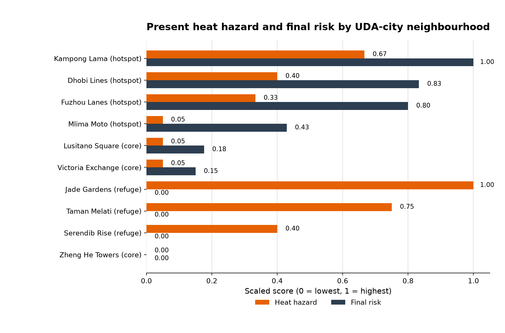

# UDA-city Heat Risk Analysis

UDA-city is a synthetic hot-humid city with 10 neighbourhoods that differ in
surface cover, building form, population exposure, and vulnerability. This
analysis uses SUEWS to estimate neighbourhood heat hazard and then links that
hazard to socio-economic heat risk. The main question is where heat-risk
planning should be prioritised, not just which place is physically hottest.

## Objective

To compare present and future neighbourhood heat risk in UDA-city, using SUEWS
modelled heat hazard together with population exposure and vulnerability, and to
identify where heat-risk planning should be prioritised.

## Meteorological Forcing

The simulations use an hourly ERA5-derived hot-humid forcing for a synthetic
coastal South Asian setting. The forcing period is `2024-03-02 01:00` to
`2024-06-01 00:00` local time, with March used as model spin-up and April-May
as the main hot-season analysis period.

The forcing variables used by SUEWS are air temperature (`Tair`), relative
humidity (`RH`), wind speed (`U`), air pressure (`pres`), incoming shortwave
radiation (`kdown`), incoming longwave radiation (`ldown`), and rainfall
(`rain`). The present scenario uses the ERA5-derived forcing directly; the
future scenario applies a uniform `+2.5 C` pseudo-warming to air temperature.

## Neighbourhood Characteristics

UDA-city has 10 synthetic neighbourhoods. Surface fractions are from the
canonical model input sidecar, and population density is in people per hectare.
The deciduous-tree fraction is `0.000` for all neighbourhoods.

| Grid | Neighbourhood | Type | Paved | Buildings | Evergreen trees | Grass | Bare soil | Water | Day pop. | Night pop. |
|---:|---|---|---:|---:|---:|---:|---:|---:|---:|---:|
| 1 | Jade Gardens | refuge | 0.593 | 0.047 | 0.108 | 0.072 | 0.100 | 0.080 | 80 | 100 |
| 2 | Serendib Rise | refuge | 0.572 | 0.068 | 0.108 | 0.072 | 0.100 | 0.080 | 80 | 100 |
| 3 | Taman Melati | refuge | 0.567 | 0.073 | 0.108 | 0.072 | 0.100 | 0.080 | 80 | 100 |
| 4 | Kampong Lama | hotspot | 0.710 | 0.140 | 0.030 | 0.020 | 0.080 | 0.020 | 300 | 400 |
| 5 | Dhobi Lines | hotspot | 0.680 | 0.170 | 0.030 | 0.020 | 0.080 | 0.020 | 300 | 400 |
| 6 | Lusitano Square | core | 0.600 | 0.200 | 0.060 | 0.040 | 0.050 | 0.050 | 250 | 130 |
| 7 | Mlima Moto | hotspot | 0.510 | 0.340 | 0.030 | 0.020 | 0.080 | 0.020 | 300 | 400 |
| 8 | Victoria Exchange | core | 0.460 | 0.340 | 0.060 | 0.040 | 0.050 | 0.050 | 250 | 130 |
| 9 | Fuzhou Lanes | hotspot | 0.500 | 0.350 | 0.030 | 0.020 | 0.080 | 0.020 | 300 | 400 |
| 10 | Zheng He Towers | core | 0.360 | 0.440 | 0.060 | 0.040 | 0.050 | 0.050 | 250 | 130 |

## Methods

1. Heat hazard was calculated from SUEWS 2 m air temperature (`T2`) as the
   number of hours where hourly mean `T2 > 35 C`. These dangerous-heat hours
   were scaled from `0` to `1` across the 10 neighbourhoods. [`risk_bridge.py`,
   `risk_bridge.md`]

2. Exposure was calculated from daytime population density (`population_day`).
   Vulnerability was calculated from older people, young children, low AC
   access (`1 - ac_access`), outdoor workers, and deprivation. Both exposure
   and vulnerability were scaled from `0` to `1`. [`neighbourhoods.yml`,
   `socioeconomic.csv`, `risk_bridge.py`]

3. Final heat risk was calculated by combining the scaled hazard, exposure, and
   vulnerability scores using a geometric mean:
   `risk = (hazard x exposure x vulnerability)^(1/3)`. The final risk score
   was scaled from `0` to `1` and used to rank neighbourhoods. [`risk_bridge.py`,
   `risk_bridge.md`]

## Heat Hazard and Risk Paradox for Present Scenario

**Table 1. Present Scenario Heat Hazard and Risk Ranking**

| Grid | Neighbourhood | Type | Dangerous heat hours | Day pop. | Hazard | Exposure | Vulnerability | Risk index | Rank |
|---:|---|---|---:|---:|---:|---:|---:|---:|---:|
| 4 | Kampong Lama | hotspot | 42 | 300 | 0.667 | 1.000 | 0.950 | 1.000 | 1 |
| 5 | Dhobi Lines | hotspot | 26 | 300 | 0.400 | 1.000 | 0.916 | 0.833 | 2 |
| 9 | Fuzhou Lanes | hotspot | 22 | 300 | 0.333 | 1.000 | 0.972 | 0.800 | 3 |
| 7 | Mlima Moto | hotspot | 5 | 300 | 0.050 | 1.000 | 1.000 | 0.429 | 4 |
| 6 | Lusitano Square | core | 5 | 250 | 0.050 | 0.773 | 0.089 | 0.176 | 5 |
| 8 | Victoria Exchange | core | 5 | 250 | 0.050 | 0.773 | 0.056 | 0.151 | 6 |
| 1 | Jade Gardens | refuge | 62 | 80 | 1.000 | 0.000 | 0.324 | 0.000 | 7 |
| 3 | Taman Melati | refuge | 47 | 80 | 0.750 | 0.000 | 0.363 | 0.000 | 7 |
| 2 | Serendib Rise | refuge | 26 | 80 | 0.400 | 0.000 | 0.274 | 0.000 | 7 |
| 10 | Zheng He Towers | core | 2 | 250 | 0.000 | 0.773 | 0.000 | 0.000 | 7 |

**Figure 1. Present-day heat hazard and final risk across UDA-city
neighbourhoods.** Both metrics are scaled from `0` to `1`, where `1` is the
highest value among the 10 neighbourhoods.

## Key Results and Interpretation

- **Kampong Lama has the highest final heat-risk score** because it combines
  substantial heat hazard with high exposure and high vulnerability.
- **Jade Gardens has the highest heat hazard** with 62 dangerous-heat hours, but
  its final risk score is low because daytime population exposure is low.
- **Hotspot neighbourhoods dominate the top risk ranks**, showing that social
  exposure and vulnerability strongly shape heat risk.
- **The ranking shows a heat hazard-risk paradox:** the hottest neighbourhood is
  not necessarily the neighbourhood where people are most at risk.
- **These scores are relative rankings within UDA-city**, so they compare the
  10 neighbourhoods with each other rather than predicting absolute health
  outcomes.

## SUEWS Citation

Jarvi, L., Grimmond, C.S.B. and Christen, A. (2011). The Surface Urban Energy
and Water Balance Scheme (SUEWS): Evaluation in Los Angeles and Vancouver.
Journal of Hydrology, 411(3-4), 219-237.

Ward, H.C., Kotthaus, S., Jarvi, L. and Grimmond, C.S.B. (2016). Surface Urban
Energy and Water Balance Scheme (SUEWS): Development and evaluation at two UK
sites. Urban Climate, 18, 1-32.
